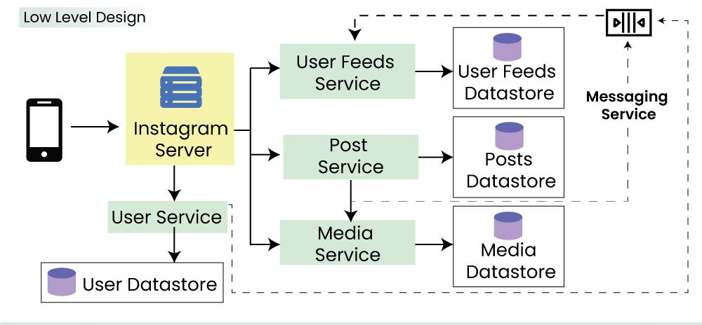
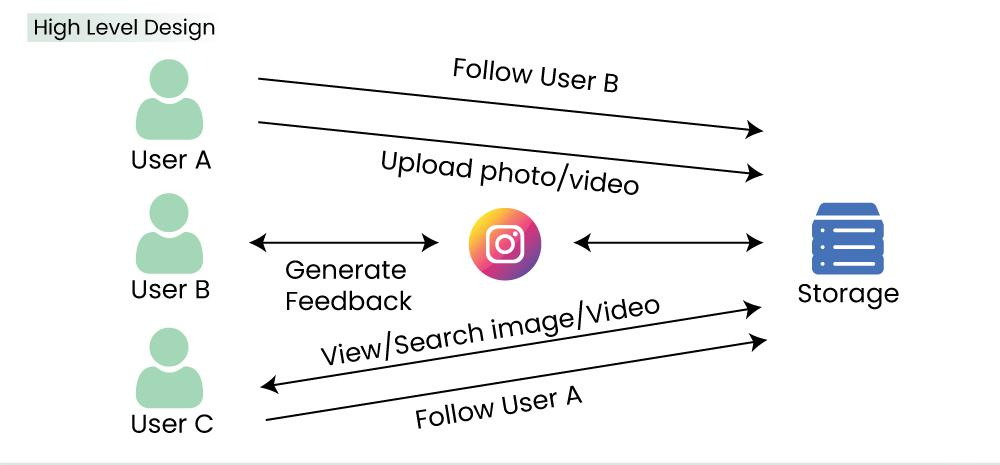

# Instagram System Design

## Table of Contents
1. [Overview](#overview)
2. [System Requirements](#system-requirements)
3. [Architecture](#architecture)
    - [Low-Level Design](#low-level-design)
    - [High-Level Design](#high-level-design)
4. [API Design](#api-design)
5. [Database Design](#database-design)
6. [Microservices](#microservices)
7. [Scalability](#scalability)
8. [Conclusion](#conclusion)

---

## Overview
Instagram is a photo and video-sharing social networking service owned by Meta Platforms. This document outlines the system design considerations and architecture for key features such as posting media, following users, liking posts, searching content, and generating news feeds.

## System Requirements

### Functional Requirements
In functional Requirements, I've not considered basic login/signup page of Instagram. As Login and Signup architecture is the same for everyone. We will look for further like posting photos, etc.

- Post photos and videos: The users can post photos and videos on Instagram.
- Follow and unfollow users: The users can follow and unfollow other users on Instagram.
- Like or dislike posts: The users can like or dislike posts of the accounts they follow.
- Search photos and videos: The users can search photos and videos based on captions and location.
- Generate news feed: The users can view the news feed consisting of the photos and videos (in chronological order) from all the users they follow.

### Non-Functional Requirements
- Scalability: The system should be scalable to handle millions of users in terms of computational resources and storage.
- Low latency: The latency to generate a news feed should be low.
- High availability: The system should be highly available.
- Data durability: Any uploaded content (photos and videos) should never get lost.
- Consistency: We can compromise a little on consistency. It is acceptable if the content (photos or videos) takes time to show in followers’ feeds located in a distant region.
- Reliability: The system must be able to tolerate hardware and software failures.

## Capacity Estimation for Instagram System Design
Here, we will be taking some of the assumptions. Let's say Instagram has around 1 billion users, with 500 million daily active users. Assume 60 million photos and 35 million videos are shared on Instagram per day. We can consider 3 MB as the maximum size of each photo and 150 MB as the maximum size of each video uploaded on Instagram.On average, each user sends 20 requests (of any type) per day to our service.

### Storage requirement per day.

| Content Type | Daily Size (TB) | Annual Size (PB)       |
|--------------|-----------------|------------------      |
| Photos       | 180             | 657                    |
| Videos       | 5250            | 1916.25                |
| Total        | 5430            | 1981.95 PB|

### Bandwidth Estimation

- Incoming Bandwidth: \( 5430 \, \text{TB} / (24 \times 60 \times 60) \)
  \[ = \frac{5430 \, \text{TB}}{86400 \, \text{sec}} \approx 62.84 \, \text{GB/s} \approx 502.8 \, \text{Gbps} \]

- Let’s say the ratio of readers to writers is 100:1.
  \[ \text{Required Outgoing Bandwidth} \approx 100 \times 502.8 \, \text{Gbps} \approx 50.28 \, \text{Tbps} \]

## Architecture

### Low-Level Design

Detailed components include:
- **User Service**:
  - Handles user registration, login, authentication, and profile management.
  - Stores user data like username, email, bio, profile picture, etc.
  - Integrates with social authentication providers (e.g., Facebook, Google).

- **Post Service**:
  - Handles photo and video uploads, editing, and deletion.
  - Stores post metadata like caption, hashtags, location, timestamp, etc.
  - Processes uploaded media for resizing, filtering, and thumbnail generation.
  - Manages photo and video transcoding for different devices and resolutions.

- **Feed Service**:
  - Generates personalized news feeds for each user based on their follows, likes, activity, and engagement.
  - Leverages a distributed system like Apache Kafka or RabbitMQ for real-time updates and notifications.
  - Utilizes a cache layer like Redis for fast feed retrieval and reduced database load.

- **Storage Service**:
  - Stores uploaded photos and videos efficiently and reliably.
  - Utilizes a scalable object storage solution like Amazon S3, Google Cloud Storage, or Azure Blob Storage.
  - Implements redundancy and disaster recovery mechanisms for data protection.

- **Search Service**:
  - Enables searching for users, hashtags, and locations.
  - Indexes users, posts, and hashtags based on relevant parameters.
  - Employs efficient indexing and search algorithms for fast and accurate results.

- **Comment Service**:
  - Handles adding, editing, and deleting comments on posts.
  - Tracks comment threads and parent-child relationships.
  - Notifies users of new comments on their own posts or comments they participated in.

- **Notification Service**:
  - Informs users about relevant events like likes, comments, mentions, and follows.
  - Pushes notifications to mobile devices through platforms like Firebase Cloud Messaging or Amazon SNS.
  - Leverages a queueing system for asynchronous notification delivery.

- **Analytics Service**:
  - Tracks user engagement, post performance, and overall platform usage.
  - Gathers data on views, likes, comments, shares, and clicks.
  - Provides insights to improve user experience, optimize content recommendations, and target advertising.

### High-Level Design
Our system should allow us to upload, view, and search images and videos at a high level. To upload images and videos, we need to store them, and upon fetching, we need to retrieve the data from the storage. Moreover, the users should also be allowed to follow each other.

At a high level, Instagram can be viewed as a system with the following key components and interactions:

- **User creates content**:
  - Client uploads photo/video.
  - Content Management stores media and metadata.
  - Feed Generation updates user’s and relevant followers’ feeds.
  - Notifications inform interested users.

- **User interacts with** content:
  - Client sends like/comment/share actions.
  - Content Management and Social Graph update relevant data.
  - Feed Generation potentially reshuffles feeds based on new interactions.
  - Notifications inform interested users.

- **User discovers new** content:
  - Client uses search functionalities.
  - Discovery & Search identifies relevant content.
  - Client displays search results.

- **User manages connections**:
  - Client sends follow/unfollow requests.
  - Social Graph updates connections.
  - Feed Generation adjusts based on changed relationships.

- **User monitors activity**:
  - Client checks notifications feed.
  - Notifications provide updates on relevant events.

## API Design

### Example API Endpoints
**Post photos and videos**
  - POST /media: Submits a new photo or video.
  - PUT /media/{media_id}: Updates existing metadata for a media item.
  - DELETE /media/{media_id}: Deletes a media item.

**Follow and unfollow users**
  - POST /users/{user_id}/follow: Follows the specified user.
  - DELETE /users/{user_id}/follow: Unfollows the specified user.
  - GET /users/{user_id}/following: Retrieves a list of users followed by the specified user (paginated).
  - GET /users/{user_id}/followers: Retrieves a list of users following the specified user (paginated).

**Like or dislike posts**
 - GET /posts/{post_id}: Retrieves details of a post, including the number of likes/dislikes.
- POST /posts/{post_id}/like: Registers a like for the post by the authenticated user.
 - POST /posts/{post_id}/dislike: Registers a dislike for the post by the authenticated user.
 - DELETE /posts/{post_id}/like: Removes the like for the post by the authenticated user (if previously done).
 - DELETE /posts/{post_id}/dislike: Removes the dislike for the post by the authenticated user (if previously done).

**Search photos and videos**
 - Typically a POST request to a /search endpoint.
 - Query parameters include:query: The search term(s), media_type: Filters results by photo, video, or both, Additional filters: date range, location, people, etc. (if supported)

## Database Design

### Example Tables

**User**
| Field              | Type          | Description             |
|--------------------|---------------|-------------------------|
| userId             | string (HashKey) | Unique identifier for the user |
| name               | string        | User's name             |
| emailId            | string        | User's email address    |
| creationDateInUtc  | long          | Timestamp of user creation in UTC |

Example row:
- **userId:** "123456789"
- **name:** "John Doe"
- **emailId:** "john.doe@example.com"
- **creationDateInUtc:** 1625126400000 (for July 1, 2021)

**User_Follows:** Tracks user relationships

| Field                        | Type          | Description                                      |
|------------------------------|---------------|--------------------------------------------------|
| followingUserId_followerUserId | string (HashKey) | Composite key combining following and follower user IDs |
| followingUserId               | string (RangeKey) | ID of the user being followed                    |
| followerUserId                | string        | ID of the user following                         |
| creationDateInUtc             | long          | Timestamp of when the connection was established |

Example row:
- **followingUserId_followerUserId:** "userA_userB"
- **followingUserId:** "userA"
- **followerUserId:** "userB"
- **creationDateInUtc:** 1625126400000 (for July 1, 2021)

**User_Uploads:** Stores uploaded media details

| Field            | Type          | Description                           |
|------------------|---------------|---------------------------------------|
| uploadId         | string (HashKey) | Unique identifier for the upload       |
| userId           | string (RangeKey) | ID of the user who uploaded            |
| imageLocation    | string        | Location/path of the uploaded image   |
| uploadDateInUtc  | long          | Timestamp of when the upload occurred |
| caption          | string        | Caption associated with the upload    |

Example row:
- **uploadId:** "upload123"
- **userId:** "userA"
- **imageLocation:** "/uploads/userA/image.jpg"
- **uploadDateInUtc:** 1625126400000 (for July 1, 2021)
- **caption:** "Beautiful sunset at the beach"

**User_Feed:** Manages user feed entries

| Field               | Type          | Description                              |
|---------------------|---------------|------------------------------------------|
| userId              | string (HashKey) | ID of the user                            |
| uploadId            | string        | ID of the upload                          |
| creationDateInUtc   | long (RangeKey) | Timestamp of when the activity occurred   |

Example row:
- **userId:** "userA"
- **uploadId:** "upload123"
- **creationDateInUtc:** 1625126400000 (for July 1, 2021)

## Database Selection
It is essential to choose the right kind of database for our Instagram system, but which is the right choice — SQL or NoSQL? Our data is inherently relational, and we need an order for the data (posts should appear in chronological order) and no data loss even in case of failures (data durability). Moreover, in our case, we would benefit from relational queries like fetching the followers or images based on a user ID. Hence, SQL-based databases fulfill these requirements.

## Scalability for Instagram System Design

Instagram ensures robust scalability by implementing the following strategies:

### Scalability
- **Elastic Scaling:** Additional servers are added to application layers to efficiently handle increased client requests.
- **Database Scaling:** Scaling databases accommodates growing user data through partitioning and replication.

### Latency
- **Caching and CDNs:** Utilization of cache layers and Content Delivery Networks (CDNs) minimizes content retrieval time.

### Availability
- **Global Replication:** Storage and databases are replicated worldwide, ensuring continuous availability to users.

### Durability
- **Persistent Storage:** Data is stored persistently with backups to prevent loss of uploaded content (photos and videos).

### Consistency
- **Global Data Consistency:** Blob stores and databases maintain global data consistency across the platform.

### Reliability
- **Redundancy and Replication:** Databases incorporate replication and redundancy, enhancing system reliability.
- **Load Balancing:** Requests are efficiently routed around failed servers, ensuring uninterrupted service.
